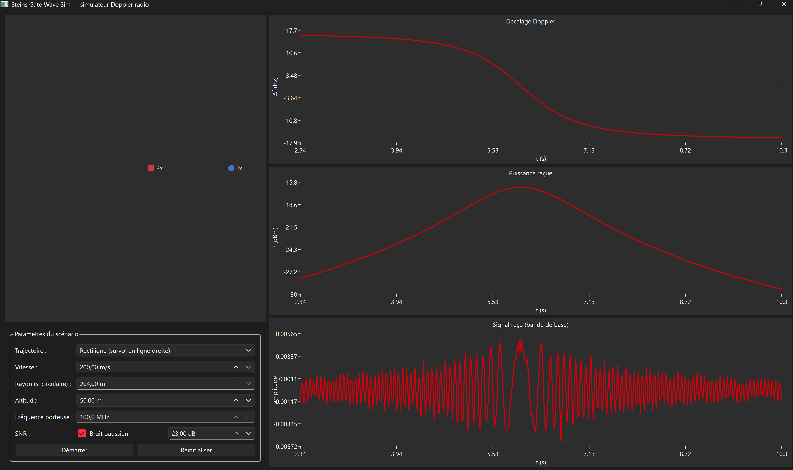
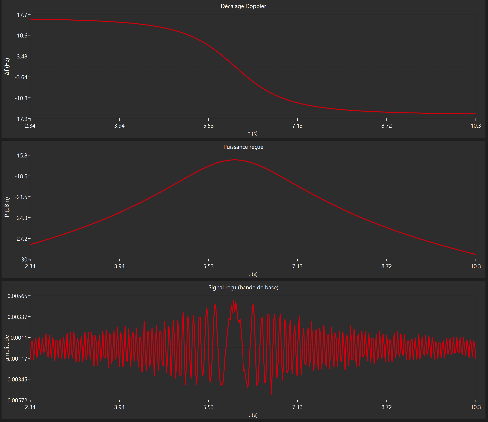
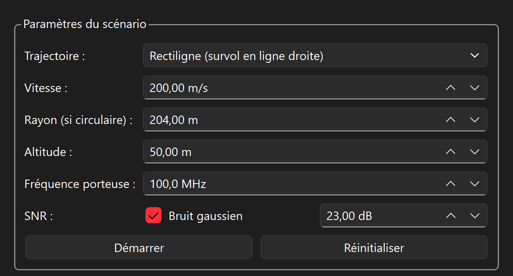
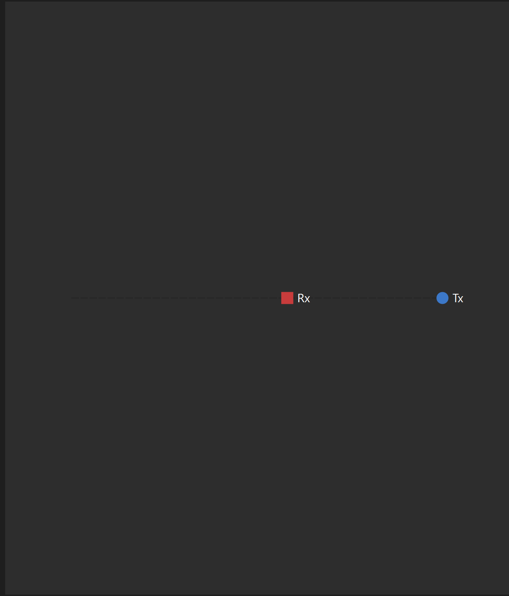

# Steins Gate Wave Sim

Simulateur pédagogique de propagation d'ondes radio avec effet Doppler,
interface Qt Widgets. Projet d'apprentissage : chaque équation et chaque
choix d'implémentation sont documentés pour être compris et défendus, pas
juste utilisés.

**Scénario physique** : un émetteur mobile (drone, avion, voiture...) se
déplace selon une trajectoire connue ; un récepteur est fixe au sol, à
l'origine du repère. À chaque instant, le simulateur calcule la distance
émetteur-récepteur, le délai de propagation, le décalage Doppler dû à la
vitesse radiale, l'atténuation en espace libre, et génère le signal reçu
correspondant.

## Sommaire

- [Physique et équations](#physique-et-équations)
- [Simplifications assumées](#simplifications-assumées-et-pourquoi-elles-sont-défendables)
- [Architecture des classes](#architecture-des-classes)
- [Interface graphique](#interface-graphique)
- [Tests unitaires](#tests-unitaires)
- [Compiler et exécuter](#compiler-et-exécuter)

## Aperçu

Scénario par défaut : survol rectiligne à 200 m/s, altitude 50 m, porteuse
100 MHz, bruit gaussien activé (SNR 23 dB).



Le décalage Doppler dessine la "courbe en S" caractéristique du survol
(positif à l'approche, franchit zéro à la distance minimale, négatif à
l'éloignement) ; la puissance reçue en dBm suit une courbe en cloche
(maximale à la distance minimale, conforme à la loi en `1/d²`) ; le signal
temporel en bande de base oscille plus vite quand `|delta_f|` est grand, et
ralentit visiblement autour du passage à zéro du Doppler :



Panneau de contrôle :



**Un bogue réel trouvé grâce à ces captures.** La toute première version de
la vue 2D (`TrajectoryView`) ressemblait à ceci — quasiment vide, les
marqueurs Rx/Tx écrasés dans une mince bande horizontale :



Cause : la trajectoire rectiligne par défaut se déplace uniquement selon
l'axe X (`y=0` constant), tout comme le récepteur. La boîte englobante
monde en Y était donc quasi nulle (~0 m) contre ~2000 m en X. Comme
`TrajectoryView` impose une échelle UNIQUE pour préserver le rapport
d'aspect (correct — voir la section Interface graphique), cette échelle
minuscule s'appliquait aussi à la petite étendue Y, écrasant tout au centre
du widget. Corrigé en imposant une étendue minimale par axe égale à une
fraction de l'autre axe (voir [TrajectoryView.cpp](src/gui/TrajectoryView.cpp)) :
une trajectoire "plate" garde maintenant de la place pour être lisible, sans
affecter les trajectoires circulaires (déjà équilibrées en X et Y). C'est un
bon exemple de bogue qu'aucun test unitaire n'aurait attrapé (c'est du rendu
Qt, hors du périmètre testé par doctest) — seule une vraie capture d'écran
l'a révélé.


## Physique et équations

Toutes les grandeurs sont en unités SI (mètres, secondes, Hz, Watts) sauf
mention contraire. `c = 299 792 458 m/s` (valeur exacte, définition du SI).

### 1. Trajectoires

**Rectiligne uniforme** — `r0` position initiale, `v0` vitesse constante :

```
r(t) = r0 + v0 * t          [m]
v(t) = v0                    [m/s]
```

**Circulaire uniforme** — dans un plan horizontal, altitude constante,
centre `C`, rayon `R`, vitesse tangentielle `v_t` :

```
omega = v_t / R                                          [rad/s]
theta(t) = theta0 + omega * t                              [rad]
r(t) = C + R * (cos(theta(t)), sin(theta(t)), 0)            [m]
v(t) = R * omega * (-sin(theta(t)), cos(theta(t)), 0)      [m/s]
```

`v(t)` est la dérivée **analytique** de `r(t)` (calculée à la main), pas une
différence finie `(r(t+dt)-r(t))/dt` : ça évite une erreur d'approximation
qui dépendrait du pas de temps choisi.

### 2. Canal de propagation

Vecteur émetteur→récepteur et distance :

```
u(t) = R_recepteur - r_emetteur(t)
d(t) = ||u(t)||                        [m]
```

**Vitesse radiale** — convention de signe : **positive = rapprochement**.

```
v_r(t) = (u(t) . v_emetteur(t)) / d(t)     [m/s]
```

Dérivation : `d(d)/dt = -(u.v)/d` (dérivée de la norme d'un vecteur dont
seule l'extrémité `r_emetteur` bouge). On définit `v_r = -d(d)/dt` (positif
quand la distance diminue), d'où `v_r = (u.v)/d`.

**Délai de propagation** :

```
tau(t) = d(t) / c              [s]
```

**Décalage Doppler** (non-relativiste, `v << c`) :

```
delta_f(t) = f_porteuse * v_r(t) / c
f_recue(t) = f_porteuse + delta_f(t)      [Hz]
```

**Puissance reçue** (Friis, espace libre, gains d'antenne unitaires) :

```
lambda = c / f_porteuse                            [m]
P_rx(t) = P_tx * (lambda / (4*pi*d(t)))^2          [W]
P_rx(dBm) = 10 * log10(P_rx(t) * 1000)
```

### 3. Signal reçu

```
phi(t) = phi(t-dt) + 2*pi*delta_f(t)*dt     [rad]   (intégration de la phase)
s(t) = sqrt(P_rx(t)) * cos(phi(t)) + bruit(t)
```

Bruit gaussien optionnel, paramétré par un SNR en dB :

```
SNR_lineaire = 10^(SNR_dB/10) = P_signal / P_bruit
sigma_bruit = sqrt(P_signal / SNR_lineaire)
bruit ~ N(0, sigma_bruit)
```

## Simplifications assumées (et pourquoi elles sont défendables)

Un projet pédagogique honnête documente ses approximations plutôt que de
les cacher. En voici quatre, choisies délibérément :

**1. Doppler non-relativiste.** La formule relativiste exacte introduit un
facteur `sqrt(1 - v²/c²) ≈ 1 - v²/(2c²)`. Pour un émetteur réaliste (même à
Mach 2, `v/c ≈ 2e-6`), cette correction est de l'ordre de `1e-12` :
totalement invisible dans toute simulation. La formule classique est donc
un choix justifié, pas une erreur.

**2. Pas de temps retardé exact.** Le signal reçu à l'instant `t` a en
réalité été émis à `t - tau`, avec la position de l'émetteur *à ce moment
d'émission*, pas à `t`. Résoudre l'équation implicite exacte
(`t_emission = t - d(t_emission)/c`) demande un point fixe itératif. Aux
échelles du simulateur (distances de l'ordre du km, `tau` de l'ordre de la
microseconde), la position de l'émetteur ne change quasiment pas pendant
`tau` — l'erreur introduite est négligeable.

**3. Gains d'antenne unitaires dans Friis** (antennes isotropes, 0 dBi).
Un modèle plus réaliste inclurait des diagrammes de rayonnement
directionnels ; ça n'apporterait rien à la compréhension de la loi en
`1/d²`, qui est l'objet de ce projet.

**4. Signal temporel affiché en bande de base, pas à la porteuse absolue.**
`PropagationChannel` calcule `f_recue` avec une porteuse **réaliste** (ex:
100 MHz à plusieurs GHz). Mais par le théorème de Nyquist-Shannon, afficher
une onde à 100 MHz demanderait un pas de temps de l'ordre de la nanoseconde
— impossible à l'échelle d'une simulation en millisecondes ou d'un
graphique à l'écran. Ce n'est pas un problème inventé pour ce projet :
c'est exactement ce que résout un vrai récepteur radio (superhétérodyne ou
SDR), qui mélange TOUJOURS le signal reçu avec un oscillateur local à la
fréquence porteuse avant numérisation, pour ne garder que la fréquence
intermédiaire. `SignalGenerator` fait la même chose : il construit sa phase
à partir du **décalage Doppler** (`delta_f`, typiquement quelques Hz à
quelques centaines de Hz pour des scénarios réalistes), pas de `f_recue`
en entier. La fréquence porteuse réelle reste utilisée pour le calcul
physique (Doppler en Hz affiché en chiffres, atténuation de Friis) — seule
sa représentation temporelle affichée est en bande de base, comme un vrai
récepteur. Si on pousse vitesse et fréquence porteuse à des valeurs
extrêmes dans l'UI, `delta_f` peut dépasser ce que le pas de temps
d'affichage peut résoudre : la courbe devient illisible (repliement de
spectre). C'est une conséquence du théorème d'échantillonnage, pas un bug.

## Architecture des classes

```
src/core/    <- moteur physique, ZÉRO dépendance Qt, testable seul
  Vec3                  vecteur 3D minimal (+, -, *scalaire, dot, norm)
  PhysicalConstants     c, pi (pas M_PI : portabilité MSVC/GCC)
  Trajectory            interface abstraite : position(t), velocity(t)
  LinearTrajectory      : Trajectory   (MRU)
  CircularTrajectory    : Trajectory   (orbite circulaire uniforme)
  Transmitter           trajectoire + fréquence porteuse + puissance
  Receiver              position fixe
  PropagationChannel    calcule distance/vitesse radiale/Doppler/délai/puissance
  SignalGenerator       génère s(t), garde un état (phase accumulée)
  Simulation            orchestre la boucle temporelle, garde l'historique

src/gui/     <- interface Qt Widgets, dépend de core/ (jamais l'inverse)
  PlotWidget            courbe X/Y générique dessinée avec QPainter
  TrajectoryView        vue 2D (position + trace émetteur, récepteur)
  ControlPanel          tous les contrôles utilisateur
  MainWindow            assemble tout, seul point de couplage core<->Qt

tests/       <- doctest, ne dépend QUE de wavesim_core (jamais de Qt)
```

### Pourquoi séparer aussi strictement `core/` et `gui/` ?

Le moteur physique (`wavesim_core`) ne contient **aucun** `#include <Q...>`.
Ça garantit trois choses concrètes :

1. **Testabilité** : les tests unitaires compilent et s'exécutent en
   quelques secondes, sans Qt installé.
2. **Confiance en cas de bug d'UI** : si un graphique affiche quelque chose
   de bizarre, on peut éliminer instantanément l'hypothèse "le calcul est
   faux" (prouvé par les tests) et chercher uniquement côté affichage.
3. **Réutilisabilité** : le même moteur pourrait alimenter une interface en
   ligne de commande, un export CSV, ou une autre UI, sans rien changer.

Dans `gui/`, le même principe est appliqué à plus petite échelle :
`PlotWidget`, `TrajectoryView` et `ControlPanel` ne connaissent aucun type
de `wavesim` (ils manipulent des `QPointF`/`double` génériques) — seul
`MainWindow` fait le pont entre les deux mondes.

## Interface graphique

- **QPainter personnalisé, pas QtCharts.** QtCharts est un module Qt
  séparé (pas garanti présent sur toute installation), ce qui aurait
  ajouté une dépendance à défendre sans l'avoir écrite soi-même. Avec
  QPainter, chaque pixel tracé est explicable. Contrepartie assumée : pas
  de zoom/tooltip interactif.
- **Vue 2D** (`TrajectoryView`) : préserve le rapport d'aspect (une seule
  échelle pour X et Y) — sinon une trajectoire circulaire apparaîtrait
  comme une ellipse à l'écran, ce qui serait trompeur.
- **Paramètres appliqués au clic sur "Réinitialiser"**, pas en direct
  pendant que la simulation tourne : le moteur physique n'expose pas de
  setters sur un `Transmitter` déjà construit (immutabilité volontaire).
  Changer un paramètre reconstruit une nouvelle `Simulation` — modèle
  mental simple, pas d'état caché.
- **Un seul pas de temps** (`dt` = intervalle du timer UI, 20 ms) pilote à
  la fois la physique et le rafraîchissement graphique : la simulation
  tourne en temps réel (1 seconde simulée = 1 seconde réelle), pas de
  facteur d'accélération séparé à gérer.
- **Fenêtre glissante d'affichage** (400 derniers échantillons) sur les
  graphiques temporels : le moteur garde tout l'historique, mais afficher
  des milliers de points sur quelques centaines de pixels ne sert à rien —
  c'est une décision d'affichage, prise dans `MainWindow`, pas dans le
  moteur.

## Tests unitaires

Framework : [doctest](https://github.com/doctest/doctest) (header unique,
vendorisé dans `external/doctest/`, compilation rapide).

| Fichier | Couverture | Pourquoi |
|---|---|---|
| `test_vec3.cpp` | norme, produit scalaire | Base de tous les calculs de distance/vitesse radiale — si faux ici, tout le reste est faux silencieusement |
| `test_trajectory.cpp` | MRU, cercle, dérivée analytique, cas limite `R=0` | Vérifie que `velocity(t)` est la vraie dérivée de `position(t)`, pas une approximation |
| `test_propagation_channel.cpp` | distance, signe du Doppler (approche +/éloignement -), `v_r=0` au point de passage au plus près, décroissance en `1/d²`, cohérence de `tau=d/c` | Chaque cas correspond à un piège de signe ou d'unité classique |
| `test_signal_generator.cpp` | borne d'amplitude, cohérence de la phase accumulée sur une période complète, `reset()`, écart-type statistique du bruit | Le test de bruit vérifie une PROPRIÉTÉ STATISTIQUE (pas une valeur exacte) car `std::normal_distribution` n'est pas garanti identique bit-à-bit entre bibliothèques standard |
| `test_simulation.cpp` | boucle temporelle (`t=0, dt, 2dt...`), `reset()` complet (y compris la phase du signal), cohérence avec un calcul manuel | Détecte les erreurs "off-by-one" classiques d'une boucle d'orchestration |

État au dernier build vérifié : **18 cas de test, 1059 assertions, tous
verts** (compilé avec GCC 13, sous WSL Ubuntu 24.04).

## Compiler et exécuter

Prérequis : CMake ≥ 3.16, un compilateur C++17 (GCC, Clang ou MSVC), et Qt6
(ou Qt5) avec le module Widgets pour l'interface graphique — optionnel :
sans Qt, `wavesim_core` et `wavesim_tests` se compilent quand même.

```bash
cmake -S . -B build -DCMAKE_BUILD_TYPE=Debug
cmake --build build -j4
```

Lancer les tests :

```bash
./build/tests/wavesim_tests
```

Lancer l'application (si Qt a été trouvé) :

```bash
./build/src/gui/wavesim_gui
```

Sous Windows avec Qt Creator : ouvrir directement `CMakeLists.txt` comme
projet, Qt Creator détecte automatiquement Qt via son kit configuré.
